# Enterprise RAG Knowledge Assistant

## Overview
The Enterprise RAG Knowledge Assistant is a high-performance, responsive web application designed to help users extract insights from multi-page PDF documents. By utilizing a Retrieval-Augmented Generation (RAG) pipeline, the assistant extracts text from documents, chunks the content, stores semantic embeddings in a local vector database, and generates contextual, cited answers in real-time.

## Features
* 📥 **Drag & Drop PDF Ingestion** — Easily upload files using drag-and-drop or select manually, with instant visual tracking of chunking stats.
* 🧠 **Local Embedding Extraction** — Computes dense semantic vectors locally on the CPU using HuggingFace sentence-transformers.
* ⚡ **ChromaDB Vector Store** — Indexes document chunks and runs high-speed L2-distance similarity queries.
* 💬 **AI-Powered Chat Interface** — Ask questions about documents and receive detailed answers powered by Groq's LLaMA 3 models.
* 📊 **Confidence Bar Indicators** — View real-time semantic alignment meters (high, medium, low) indicating database relevance scores.
* 📜 **Page Citations Accordion** — Click to expand and view exact source passages, relevance scores, and page numbers referenced.
* 📤 **Chat History Export** — Download clean, formatted conversation txt logs containing questions, answers, and pages cited.
* ⌨️ **Keyboard Shortcuts** — Trigger actions instantly: `Ctrl+U` to open file dialogs, and `Escape` to go back to upload workspace.
* 📱 **Fully Responsive UI** — Beautiful dark glassmorphism layout tailored for Mobile overlay menus, Tablet grids, and Desktop monitors.

## Tech Stack

| Technology | Purpose | Why Chosen |
| :--- | :--- | :--- |
| **FastAPI** | Backend Web Framework | Asynchronous capability, automatic API documentation, and fast request handling. |
| **ChromaDB** | Vector Database | Open-source, easy local setup, and robust document metadata filtering. |
| **SentenceTransformers** | Local Embeddings Generator | Generates high-quality 384-dimensional text vectors locally on the host CPU. |
| **Groq Cloud API** | Large Language Model Service | Unmatched inference speeds (LLaMA-3.1-8b-instant) with zero-cost developer tier. |
| **React (Vite)** | Frontend Single-Page App | Ultra-fast Hot Module Replacement (HMR) and modular, component-based workspace architecture. |
| **Vanilla CSS** | Modern App Aesthetics | Total visual control for dark mode layouting, custom shimmer animations, and glassmorphism cards without third-party bloat. |

## Getting Started

### Prerequisites
* **Python 3.10+** (tested on Python 3.14.2)
* **Node.js 18+**
* **Groq API Key** (Get yours free at [console.groq.com](https://console.groq.com/))

### Installation

1. **Clone the Repository & Navigate to Folder**
   ```bash
   cd "c:\Users\usmanbari\Desktop\Enterprise RAG Knowledge Assistant\rag-knowledge-assistant"
   ```

2. **Backend Setup**
   Create a virtual environment, activate it, and install required dependencies:
   ```bash
   # Create environment
   python -m venv .venv

   # Activate on Windows (PowerShell)
   .venv\Scripts\Activate.ps1

   # Install requirements
   pip install -r backend/requirements.txt
   ```

3. **Frontend Setup**
   Navigate to the frontend folder and install npm packages:
   ```bash
   cd frontend
   npm install
   cd ..
   ```

4. **Environment Configuration**
   Create a `.env` file inside the `rag-knowledge-assistant` root folder with the following variables:
   ```env
   GROQ_API_KEY=your_groq_api_key_here
   GROQ_MODEL=llama-3.1-8b-instant
   ```

### Running the App

1. **Start the Backend Service**
   Run the FastAPI dev server on port `8000` (make sure your virtual environment is active):
   ```bash
   # From the rag-knowledge-assistant root folder
   uvicorn backend.main:app --host 0.0.0.0 --port 8000 --reload
   ```

2. **Start the React Frontend**
   Run the Vite development server on port `5173`:
   ```bash
   # Open a separate shell window in the frontend directory
   cd frontend
   npm run dev
   ```
   Open your browser and visit [http://localhost:5173](http://localhost:5173).

## Project Structure

```text
rag-knowledge-assistant/
├── .env                              # Stores Groq API credentials and configured LLM models
├── README.md                         # Project documentation and developer reference manual
├── backend/                          # FastAPI REST API Backend
│   ├── config.py                     # Initializes data directories, environment keys, and models
│   ├── main.py                       # Declares API endpoints (upload, query, statistics, delete)
│   ├── requirements.txt              # Standard Python packages and dependencies
│   ├── schemas.py                    # Declares Pydantic models for type safety and validation
│   └── services/                     # Business logic modular service singletons
│       ├── __init__.py               # Instantiates and exports singletons for all services
│       ├── embedding_service.py      # Translates chunks into 384-dimensional dense vectors
│       ├── llm_service.py            # Manages rate-limited Groq prompts and generation streams
│       ├── pdf_service.py            # Extracts text from PDFs and splits into semantic chunks
│       └── vector_store_service.py   # Manages ChromaDB index operations and similarity search
└── frontend/                         # Vite + React Single-Page Application Frontend
    ├── package.json                  # Frontend package configurations and build scripts
    ├── vite.config.js                # Vite development server settings
    ├── index.html                    # Single-page wrapper DOM shell
    └── src/                          # Application source code
        ├── main.jsx                  # Entry node rendering App.jsx inside the DOM
        ├── App.jsx                   # Central layout coordinator, toast container, and shortcut hooks
        ├── App.css                   # Custom stylesheets: animations, layout grids, and variables
        ├── api.js                    # Wraps standard fetch calls for API communication
        └── components/               # Pure UI modules
            ├── Sidebar.jsx           # Panel listing uploaded files with skeleton pulse cards
            ├── DocumentCard.jsx      # List element for document selector and delete controls
            ├── UploadView.jsx        # Drag-and-drop ingestion dashboard
            ├── ChatView.jsx          # Conversation pane with chat exports and suggestions
            ├── ChatInput.jsx         # Input text area supporting auto-expand and sending keys
            ├── MessageBubble.jsx     # Renders chat history with confidence meters and warning indicators
            ├── SourceCard.jsx        # Segment details detailing relevance score and page matches
            └── TypingIndicator.jsx   # Thinking loader animation
```

## How It Works

```mermaid
graph TD
    %% Document Ingestion Flow
    subgraph Ingestion Pipeline
        A[PDF Upload] --> B[PyMuPDF Text Extractor]
        B --> C[Semantic Chunker]
        C --> D[Local SentenceTransformer]
        D --> E[(ChromaDB Vector Store)]
    end

    %% Query Pipeline Flow
    subgraph Query Execution
        F[User Query] --> G[Local SentenceTransformer]
        G --> H[ChromaDB Similarity Search]
        H -->|Retrieve top-N chunks| I[Context Assembler]
        I -->|System Prompt + Context| J[Groq LLaMA 3.1 LLM]
        J --> K[Cited Answer + Confidence Score]
    end
```



### 1. Document Ingestion
* **Text Extraction**: PyMuPDF reads the uploaded PDF, preserving page numbers for metadata.
* **Semantic Chunking**: Text is split into overlapping chunks to ensure semantic continuity.
* **Vector Embeddings**: The `all-MiniLM-L6-v2` model embeds chunks into dense vectors.
* **ChromaDB Storage**: Vectors and text metadata (file name, page number) are stored in local database files.

### 2. Query Processing
* **Similarity Search**: User question is embedded and matched against ChromaDB using L2 distance.
* **Relevance Thresholding**: Computes average relevance. If average score is `< 0.3`, a low-confidence warning is generated.
* **LLM Ingestion**: Groq receives context chunks and provides the response, identifying page references dynamically.

## Screenshots


## Future Improvements
* 🔄 **Multi-Format Support** — Extend pipeline parsing to accept `.docx`, `.txt`, and `.csv` files.
* 🤖 **Hybrid Search** — Integrate BM25 keyword matching with semantic vector search for precise keyword retrieval.
* 🔍 **Document Viewer Integration** — Render pages of the PDF directly in a split-screen view when clicking source citations.
* 🔑 **Authentication & Multi-Tenant Isolation** — User log-ins with encrypted vector collection access boundaries.
* 🧠 **LLM Agent Re-ranking** — Add a Cohere/BGE re-ranking step to refine query chunks before prompting Groq.

## License
[MIT](LICENSE)
